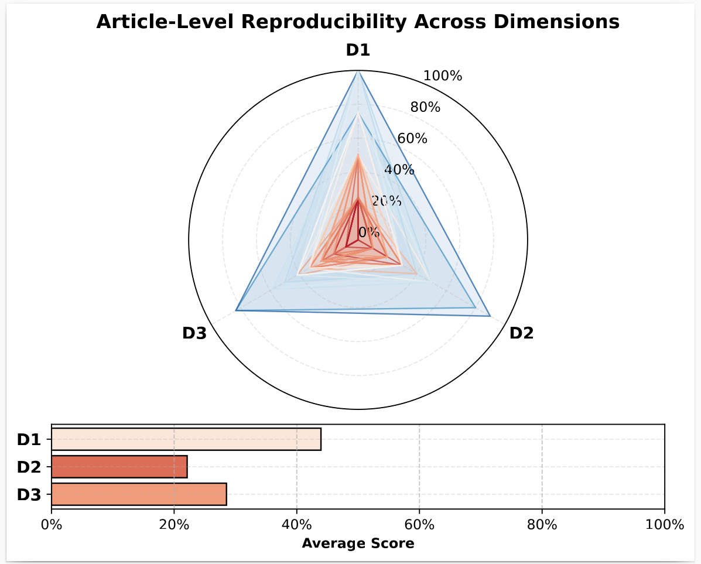
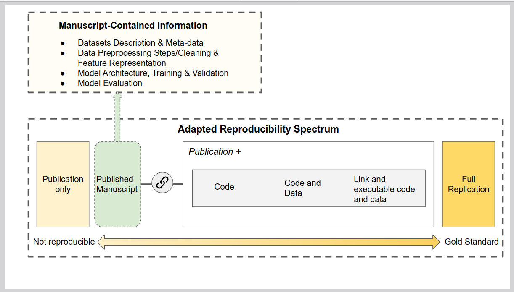
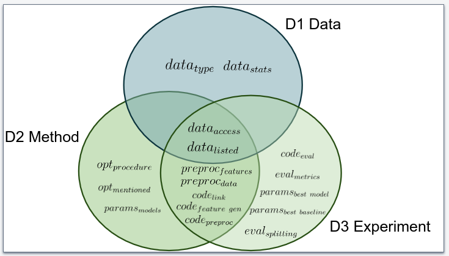

# Reproducibility of Machine Learning-Based Fault Detection and Diagnosis for HVAC Systems in Buildings: An Empirical Study

## Abstract

Clear and well-documented research experiments are essential, as they allow researchers to reproduce results and verify the authors' claims. Reproducibility is an inherent characteristic of research and should be given heightened importance, however, the rise of machine learning (ML) techniques has introduced new challenges to achieving it. Thus, both the experimental configuration and the proposed methodology should be documented in a clear and standardized manner. Recently, the use of ML techniques has grown common in building systems scientific disciplines. As this discipline expands in its scope and complexity of its methods, concerns have arisen against this backdrop, much like in other fields, about the materials shared along with the proper documentation to support reproducibility. Therefore, in this study, we aim to analyze ML-based fault detection and diagnosis techniques for building system and quantify them across a list of reproducibility dimensions. Our analysis revealed concerning findings, indicating that nearly all articles are technically irreproducible due to insufficient disclosure across reproducibility dimensions, i.e., *data*, *preprocessing*, *evaluation*, and especially *hyperparameter* and *code availability*. These findings highlight the need for intervention and reproducibility guidelines. With this, we aim to contribute to the development of more transparent, reliable, and verifiable research in the field.

## Contents

- [`data/`](https://github.com/tuw-isab/reproducibility-analysis-ml-based-fdd-hvac/tree/main/data) — Directory contains recorded reproducibility variables (checklist).
- [`notebooks/`](https://github.com/tuw-isab/reproducibility-analysis-ml-based-fdd-hvac/tree/main/notebooks) - Directory contains notebooks for data preprocessing, scopus API call and data analysis.
- [`results/`](https://github.com/tuw-isab/reproducibility-analysis-ml-based-fdd-hvac/tree/main/results) — Output of the reproducibility assessment (e.g., plots).
- [`paper/`](https://github.com/tuw-isab/reproducibility-analysis-ml-based-fdd-hvac/tree/main/paper) — The manuscript is available in this directory.
- [`figures/`](https://github.com/tuw-isab/reproducibility-analysis-ml-based-fdd-hvac/tree/main/figures) — Directory contains figures used in the study.

